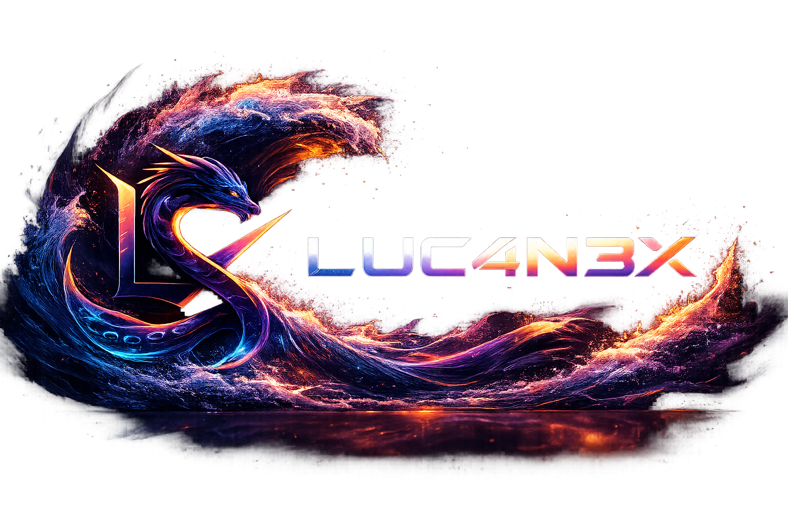

<div align="center">




# LUC4N3X

### Software Developer · Builder · Problem Solver

I like turning messy ideas into clean, practical and good-looking software.

<br />


</div>

---

## 🌊 About Me

I'm a developer who enjoys building software with a clear purpose: tools that are useful, fast, clean and pleasant to use.

I like working on backend logic, automation, dashboards, routing systems, integrations, user interfaces and small utilities that remove friction from everyday workflows.

My favorite kind of project is the one that starts as a rough idea, becomes a working prototype, and then slowly turns into something stable, polished and actually enjoyable to use.

Visually, I prefer dark interfaces, ocean-inspired details, sharp layouts, soft glow, clean cards and that modern developer-tool feeling: practical, elegant and never overloaded.

---

## 🧠 What I Like Building

<table>
  <tr>
    <td width="50%" valign="top">
      <h3>⚙️ Backend Tools</h3>
      <p>APIs, services, routing logic, validation layers, background jobs and systems designed to stay reliable under real usage.</p>
    </td>
    <td width="50%" valign="top">
      <h3>🧩 Automation</h3>
      <p>Small but powerful workflows that reduce manual work, connect services together and make repeated tasks simpler.</p>
    </td>
  </tr>
  <tr>
    <td width="50%" valign="top">
      <h3>🌌 Modern Interfaces</h3>
      <p>Dark dashboards, clean cards, responsive layouts, soft glass effects and interfaces that feel professional without becoming heavy.</p>
    </td>
    <td width="50%" valign="top">
      <h3>🛠️ Developer Utilities</h3>
      <p>Scripts, diagnostics, configuration helpers, logs, monitoring flows and tools that make development easier to manage.</p>
    </td>
  </tr>
</table>

---

## 🔥 Current Focus

```txt
Backend logic        → cleaner flows, stronger structure, better reliability
Automation           → less repetition, more control, faster iteration
Modern UI            → polished layouts, readable sections, responsive design
Developer tooling    → diagnostics, logs, configuration and practical utilities
Open-source work     → building in public, improving steadily, learning by doing
```

---

## 🛠️ Tech Stack

<div align="center">


</div>

---

## 🧭 How I Work

<table>
  <tr>
    <td width="33%" valign="top">
      <h3>01 · Build</h3>
      <p>I start from the practical problem and move fast toward something that works.</p>
    </td>
    <td width="33%" valign="top">
      <h3>02 · Refine</h3>
      <p>I clean the structure, improve the flow, remove noise and make the system easier to understand.</p>
    </td>
    <td width="33%" valign="top">
      <h3>03 · Polish</h3>
      <p>I care about the final feeling: readable code, clear UI, useful logs and a smooth user experience.</p>
    </td>
  </tr>
</table>

---

## 📊 GitHub Stats

<div align="center">


<br />
<br />


</div>

---

## 🌐 Find Me

<div align="center">

<a href="https://github.com/LUC4N3X" target="_blank" rel="noreferrer">
  
</a>

</div>

---

<div align="center">


<br />

### Built with curiosity, patience and a deep-ocean kind of style.

</div>
