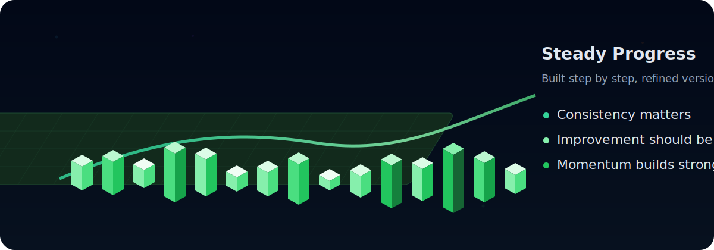

<div align="center">


<br />
<br />

# LUC4N3X

### Software Developer · Builder · Problem Solver

<p>
  I build practical software with clean logic, strong structure and a polished user experience.
</p>

<p>
  I like tools that feel simple on the surface, solid underneath and memorable in the way they look and behave.
</p>

<br />

<a href="https://github.com/LUC4N3X">
  
</a>


</div>

---

## About Me

I'm Luca.

I enjoy turning rough ideas into tools that are clean, reliable and genuinely useful. When I build something, I care about the whole experience: the logic has to be strong, the structure has to stay readable and the final interface has to feel polished for the people using it.

Most of the work I enjoy sits around backend systems, automation, integrations, dashboards and developer-focused utilities. I like projects that solve practical problems and still keep a clear identity.

The kind of software I want my name attached to is simple to use, technically solid and visually recognizable.

---

## What I Build

<table>
  <tr>
    <td width="50%" valign="top">
      <h3>Backend Systems</h3>
      <p>
        APIs, services, routing logic, validation layers, background jobs and structured flows designed to stay stable under real usage.
      </p>
    </td>
    <td width="50%" valign="top">
      <h3>Automation Tools</h3>
      <p>
        Workflows that remove repetition, connect services together and make daily tasks cleaner and easier to manage.
      </p>
    </td>
  </tr>
  <tr>
    <td width="50%" valign="top">
      <h3>Modern Interfaces</h3>
      <p>
        Clean layouts, readable sections, dark themes, ocean-inspired details and a professional developer-tool feel.
      </p>
    </td>
    <td width="50%" valign="top">
      <h3>Developer Utilities</h3>
      <p>
        Diagnostics, configuration helpers, logs, monitoring views and small tools that make development easier to understand.
      </p>
    </td>
  </tr>
</table>

---

## What You Can Expect From My Projects

```txt
Clear purpose        → every feature should solve a real problem
Clean structure      → readable logic, maintainable flows and fewer hidden surprises
Fast iteration       → build, test, improve, repeat
User-first design    → simple usage, clear feedback and polished presentation
Reliable behavior    → stable defaults, useful logs and practical fallbacks
```

I prefer software that does its job well, stays clear under pressure and still feels good to use.

---

## Tech Stack

<div align="center">


</div>

---

## How I Work

<table>
  <tr>
    <td width="33%" valign="top">
      <h3>01 · Build</h3>
      <p>I start from the real problem and move quickly toward a working version.</p>
    </td>
    <td width="33%" valign="top">
      <h3>02 · Refine</h3>
      <p>I simplify the structure, improve the flow and remove what does not help the project.</p>
    </td>
    <td width="33%" valign="top">
      <h3>03 · Polish</h3>
      <p>I care about the final feeling: clear UI, useful logs, stable behavior and a clean presentation.</p>
    </td>
  </tr>
</table>

---

## Rhythm & Consistency

<div align="center">
  
</div>

<p align="center">
  I like building steadily: improving version after version, keeping momentum, and turning progress into something visible.
</p>

<table>
  <tr>
    <td width="33%" align="center">
      <strong>Steady Output</strong><br />
      ship, test, refine
    </td>
    <td width="33%" align="center">
      <strong>Clean Direction</strong><br />
      clear goals, practical decisions
    </td>
    <td width="33%" align="center">
      <strong>Constant Improvement</strong><br />
      every version should be better than the last
    </td>
  </tr>
</table>

---

## Current Direction

I am focused on building tools that combine strong backend logic with a modern, polished interface.

I like a dark, ocean-inspired visual style with sharp layouts, soft glow, clean cards and a premium developer-tool identity.

---

## Contact

<div align="center">

<p>
  I build, test, improve and keep pushing projects until they feel solid.
  <br />
  If something can be cleaner, faster or more useful, I want to make it better.
</p>

<a href="https://github.com/LUC4N3X">
  
</a>

<br />
<br />


<br />
<br />

<strong>Built with focus, patience and a deep-ocean kind of style.</strong>

</div>
