<div align="center">


# LUC4N3X

### Software Developer · Builder · Problem Solver

I like turning messy ideas into clean, practical and good-looking software.

<br />

<a href="https://github.com/LUC4N3X"></a>


</div>



##  ABOUT 

I build small, sharp tools where the backend meets the interface — services, integrations, proxies, schedulers, and the occasional dashboard that doesn't lie. I take rough ideas, ship working prototypes, then keep refining until they feel quiet under load and pleasant to use.

Most of my work lives in the layer users never see: routing logic, validation, retries, caches, queues. Some of it lives right in front of them: dark surfaces, considered density, layouts that breathe. I like the seam between the two.

> Aesthetic bias: deep navy, cyan glow, sharp edges, the modern developer-tool feel — practical, elegant, never overloaded.


##  WHAT I BUILD 

<table width="100%">
  <tr>
    <td width="50%" valign="top">
      <h3>◆ Backend Systems</h3>
      <p>APIs, services, routing layers, validation, background workers and queues. Built to stay calm under real traffic and fail loudly when something actually goes wrong.</p>
    </td>
    <td width="50%" valign="top">
      <h3>◆ Automation</h3>
      <p>Quiet workflows that remove the manual parts. Connectors between services, schedulers, retry logic, the kind of pipelines you set up once and forget.</p>
    </td>
  </tr>
  <tr>
    <td width="50%" valign="top">
      <h3>◆ Modern Interfaces</h3>
      <p>Dark dashboards, glassy cards, responsive grids, soft glow. Practical UI with personality — never the same generic SaaS layout twice.</p>
    </td>
    <td width="50%" valign="top">
      <h3>◆ Developer Utilities</h3>
      <p>Diagnostics, log readers, config helpers, monitoring shims, small CLIs. The unglamorous 5% that makes the other 95% easier to ship.</p>
    </td>
  </tr>
</table>


##  CURRENT FOCUS 

```txt
┌─ deep-channel · luc4n3x@abyss ──────────────────────────────────────
│
│  backend       →  cleaner flows, stronger structure, real reliability
│  automation    →  less repetition, more control, faster iteration
│  interfaces    →  polished layouts, considered density, dark by default
│  tooling       →  diagnostics, logs, config, the quiet 5%
│  open source   →  ship in public, refine in the open
│
│  status        →  shipping  ·  building  ·  listening on CH·07
│
└─────────────────────────────────────────────────────────────────────
```


##  TECH STACK 

<div align="center">

**Languages**


**Runtimes & Frameworks**


**Data & Cache**


**Infrastructure**


**Tools**


</div>


##  HOW I WORK 

<table width="100%">
  <tr>
    <td width="33%" valign="top" align="left">
      <h3>01 · BUILD</h3>
      <p>Start from the real problem, move fast toward something that works end-to-end. Prototype first, perfect later.</p>
    </td>
    <td width="33%" valign="top" align="left">
      <h3>02 · REFINE</h3>
      <p>Clean the structure, simplify the flow, drop what isn't earning its weight. The boring pass that decides whether the thing survives contact with reality.</p>
    </td>
    <td width="33%" valign="top" align="left">
      <h3>03 · POLISH</h3>
      <p>Readable code, clear UI, useful logs, sensible defaults. The pass that decides whether you actually enjoy using it.</p>
    </td>
  </tr>
</table>


##  TELEMETRY 

<div align="center">


<br /><br />


<br /><br />


<br /><br />


</div>


##  FIND ME 

<div align="center">

<a href="https://github.com/LUC4N3X" target="_blank" rel="noreferrer">
  
</a>

</div>


<div align="center">

<br />

```txt
$ luc4n3x@abyss:~$ echo "built with curiosity, patience, and a deep-ocean kind of style."
```

<br />

<sub><i>Listening on CH·07 · still descending · 0xLUC4N3X</i></sub>

</div>
