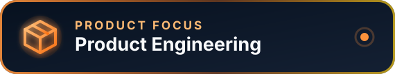
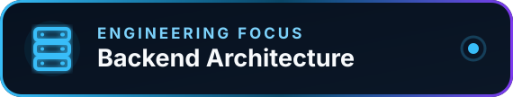
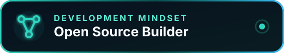
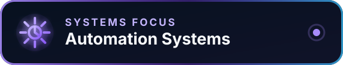
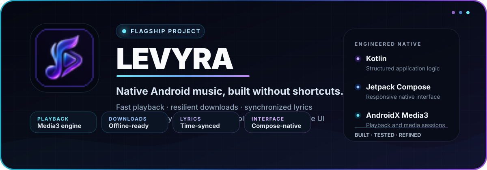
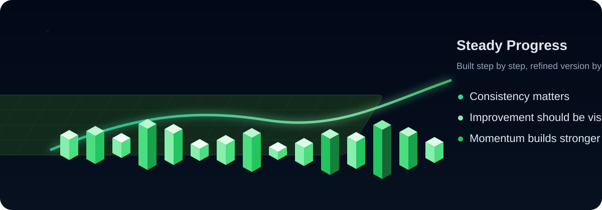

<div align="center">

<picture>
  <source media="(prefers-color-scheme: dark)" srcset="./assets/brand/luc4n3x-lockup-dark.svg">
  <source media="(prefers-color-scheme: light)" srcset="./assets/brand/luc4n3x-lockup.svg">
  
</picture>

<br />

**I build software I want to use — and keep working on it until it feels right.**

`Android` · `Kotlin` · `Jetpack Compose` · `Python` · `APIs` · `Docker`

<br />


</div>

## About me


Hey, I'm Luca. I like taking rough ideas and turning them into software I can actually use.

Most days I bounce between **Android apps, backend services, tooling and infrastructure**. I enjoy the part after something starts working: finding what still feels off, fixing the weird edge cases and making the whole thing cleaner.

- I work mostly with **Kotlin, Jetpack Compose, Python, Node.js, Linux and Docker**
- I like bugs that only show up on one device, one network or one very specific path
- I prefer a focused fix I understand well over a rewrite just because the diff looks impressive
- **Levyra** is where a lot of my Android and product ideas end up
- If it involves **Android, self-hosting, APIs, performance or useful tools**, I'm probably interested

<br clear="right"/>

<br />

<table width="100%" align="center">
  <tr>
    <td align="center" width="50%">
      
    </td>
    <td align="center" width="50%">
      
    </td>
  </tr>
  <tr>
    <td align="center" width="50%">
      
    </td>
    <td align="center" width="50%">
      
    </td>
  </tr>
</table>

<br />



<br />

## ✦ Flagship Project: Levyra

<div align="center">

<a href="https://github.com/LUC4N3X/Levyra-deepsound">
  
</a>

<br />

[](https://github.com/LUC4N3X/Levyra-deepsound/stargazers)
[](https://github.com/LUC4N3X/Levyra-deepsound/releases/latest)
[](https://github.com/LUC4N3X/Levyra-deepsound/blob/main/LICENSE)
[](https://levyra.dpdns.org)

</div>

> **Levyra** is a modern open-source music player engineered for Android and Windows. Built without shortcuts: native AndroidX Media3 playback engine, offline-first download resilience, time-synchronized lyrics, and a responsive Jetpack Compose interface.

<table width="100%">
  <tr>
    <td width="50%" valign="top">
      <h4>⚡ Playback & Audio Engine</h4>
      <p>Low-latency AndroidX Media3 / ExoPlayer pipeline, custom audio session management, gapless playback, and resilient queue restoration.</p>
      <code>Kotlin</code> · <code>Media3</code> · <code>ExoPlayer</code> · <code>Coroutines</code>
    </td>
    <td width="50%" valign="top">
      <h4>📦 Offline-First & Downloads</h4>
      <p>Resumable background downloads, local cache hierarchy, duplicate prevention, audio tag embedding, and storage integrity checks.</p>
      <code>Room DB</code> · <code>WorkManager</code> · <code>Cache Architecture</code>
    </td>
  </tr>
  <tr>
    <td width="50%" valign="top">
      <h4>🎙️ Synced Lyrics & Discovery</h4>
      <p>Real-time scrolling synchronized lyrics, multi-provider resolution scoring, rich metadata enrichment, and ambient discovery algorithms.</p>
      <code>REST APIs</code> · <code>LevyraExtractor</code> · <code>Lyrics Engine</code>
    </td>
    <td width="50%" valign="top">
      <h4>🎨 Native Fluid Experience</h4>
      <p>Pure Jetpack Compose UI with Material You dynamic color adaptation, smooth canvas gestures, desktop layout support, and refined micro-interactions.</p>
      <code>Jetpack Compose</code> · <code>Material 3</code> · <code>Desktop Compose</code>
    </td>
  </tr>
</table>

<br />

---

## ⚡ Engineered Systems & Core Repositories

<table width="100%">
  <tr>
    <td width="50%" valign="top">
      <h3>
        <a href="https://github.com/LUC4N3X/Levyra-deepsound">
          
          Levyra
        </a>
      </h3>
      <p><strong>Open-source native music player for Android & Windows.</strong></p>
      <p>Uninterrupted playback, background media services, time-synced lyrics, and rich artwork designed for an authentic listening experience.</p>
      <p>
        
        
        
      </p>
      <p>🔗 <a href="https://github.com/LUC4N3X/Levyra-deepsound"><strong>Explore Repository</strong></a> · <a href="https://levyra.dpdns.org"><strong>Web Portal</strong></a></p>
    </td>
    <td width="50%" valign="top">
      <h3>
        <a href="https://github.com/LUC4N3X/antigravity-thalarch">
          
          antigravity-thalarch
        </a>
      </h3>
      <p><strong>High-rigor engineering layer & verification framework for AI agents.</strong></p>
      <p>Multi-agent reliability skill: grounds facts against the real environment, enforces adversarial code review, and validates evidence before delivery.</p>
      <p>
        
        
        
      </p>
      <p>🔗 <a href="https://github.com/LUC4N3X/antigravity-thalarch"><strong>Explore Repository</strong></a></p>
    </td>
  </tr>
  <tr>
    <td width="50%" valign="top">
      <h3>
        <a href="https://github.com/LUC4N3X/Instara-Crew">
          
          Instara-Crew
        </a>
      </h3>
      <p><strong>Multi-account Instagram operations & automation console.</strong></p>
      <p>Powered by Google Gemini AI, persistent session management, job queues, smart humanized interactions, and real-time operational telemetry.</p>
      <p>
        
        
        
      </p>
      <p>🔗 <a href="https://github.com/LUC4N3X/Instara-Crew"><strong>Explore Repository</strong></a></p>
    </td>
    <td width="50%" valign="top">
      <h3>
        <a href="https://github.com/LUC4N3X/LevyraExtractor">
          
          LevyraExtractor & Media Labs
        </a>
      </h3>
      <p><strong>High-performance media extraction & streaming infrastructure.</strong></p>
      <p>Custom media extractor stack powering Levyra, plus HLS/MP4 reverse proxies, resilient edge routing, and streaming gateway protocols.</p>
      <p>
        
        
        
      </p>
      <p>🔗 <a href="https://github.com/LUC4N3X/LevyraExtractor"><strong>Explore Extractor</strong></a></p>
    </td>
  </tr>
</table>

<br />

---

## 🛠️ Technical Arsenal

<div align="center">

### Mobile & System Development


<br />

### Backend, APIs & Automation


<br />

### Infrastructure & Engineering Environment


</div>

<br />

---

## 📈 Activity & Development Momentum

<div align="center">



<br /><br />

<table width="100%" align="center">
  <tr>
    <td align="center" width="50%">
      <a href="https://github.com/LUC4N3X">
        
      </a>
    </td>
    <td align="center" width="50%">
      <a href="https://github.com/LUC4N3X">
        
      </a>
    </td>
  </tr>
</table>

</div>

<br />

---

## 🧭 How I Build

```text
┌───────────────────────────────┐
│   Understand the real issue   │  Inspect failure modes and real constraints
└───────────────┬───────────────┘
                ↓
┌───────────────────────────────┐
│    Build the observable core  │  Focused architecture without bloated abstractions
└───────────────┬───────────────┘
                ↓
┌───────────────────────────────┐
│     Stress the edge cases     │  Flaky networks, device quirks, race conditions
└───────────────┬───────────────┘
                ↓
┌───────────────────────────────┐
│    Ship the polished result   │  Fluid transitions, solid caching, zero fluff
└───────────────────────────────┘
```

<div align="center">

### **Build it. Use it. Break it. Understand it. Ship the better version.**

<br />

<a href="https://github.com/LUC4N3X?tab=repositories">
  
</a>

<br /><br />


<sub>Engineered with precision by <strong><a href="https://github.com/LUC4N3X">LUC4N3X</a></strong></sub>

</div>