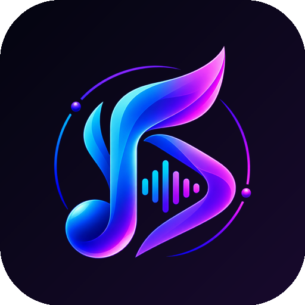
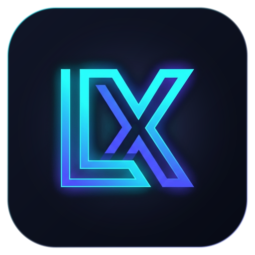

 
 

**I build software I actually want to use — then keep fixing it until it feels solid.**

`Android` · `Kotlin` · `Jetpack Compose` · `Media3` · `Python` · `Node.js` · `Docker`

---

## Hey, I'm Luca.

I like taking rough ideas and turning them into software that feels finished.

Most of my work sits somewhere between **Android apps, media systems, backend services, automation and developer tooling**. I care about the obvious things — speed and a good UI — but also the less glamorous parts that usually decide whether a product is actually pleasant to live with: memory use, flaky networks, retries, caching, fallbacks, logs and weird device-specific bugs.

Right now, most of my attention goes into **Levyra** and the tools around the way I build and debug software.

---

## Selected work

<table>
  <tr>
    <td width="64" valign="top">
      
    </td>
    <td valign="top">
      <h3><a href="https://github.com/LUC4N3X/Levyra-deepsound">Levyra</a></h3>
      

        The project I spend the most time on: a modern Android music app built with Kotlin, Jetpack Compose and Media3.
        Playback, downloads, discovery, lyrics, video mode and the player itself all live in the same product, so there is always another edge case worth chasing.
      

      

        <code>Kotlin</code> · <code>Jetpack Compose</code> · <code>Media3 / ExoPlayer</code> · <code>Android</code>
      

      
      
    </td>
  </tr>
</table>

 

<table>
  <tr>
    <td width="64" valign="top">
      
    </td>
    <td valign="top">
      <h3><a href="https://github.com/LUC4N3X/antigravity-thalarch">Antigravity Thalarch</a></h3>
      

        A multi-agent engineering and reliability toolkit for AI coding workflows. I built it around a simple problem:
        generating more code is not very useful if planning, review, debugging and verification are weak.
      

      

        <code>Python</code> · <code>AI agents</code> · <code>code review</code> · <code>debugging</code> · <code>developer tools</code>
      

    </td>
  </tr>
</table>

---

## What I work with

I do not try to collect technologies for the sake of having a longer list. These are the ones that show up regularly in my projects:

**Android**  
`Kotlin` · `Jetpack Compose` · `Media3 / ExoPlayer` · `Coroutines` · `Room`

**Services & automation**  
`Python` · `Node.js` · `FastAPI` · `REST APIs` · `Docker`

**Infrastructure & data**  
`Linux` · `GitHub Actions` · `Cloudflare` · `PostgreSQL` · `Redis`

---

## The part of engineering I enjoy most

I tend to get interested when something works **almost** perfectly.

A player that is smooth on one phone but slowly grows memory on another. A download that succeeds nine times out of ten. A resolver that is fast until one upstream service starts behaving badly. A UI that technically works but still feels one pass away from being right.

Those are usually the problems I keep digging into.

My preferred fix is rarely a giant rewrite. I would rather understand the failure, change the smallest useful part, test the ugly paths and leave the codebase easier to reason about than I found it.

---

## Currently

- Building and refining **Levyra** across Android playback, media handling, downloads and UI.
- Working on better tooling for **debugging, code review and AI-assisted engineering**.
- Keeping my public projects useful instead of treating them as portfolio screenshots.

---

### Build it. Use it. Find what breaks. Make it better.

If something in one of my public repositories breaks, open an issue. I actually read them.

 

