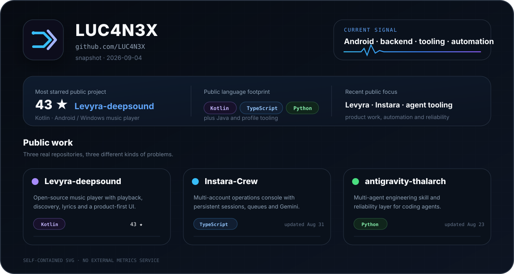
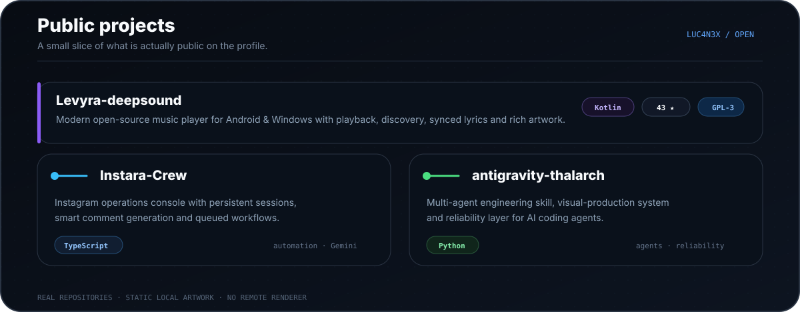
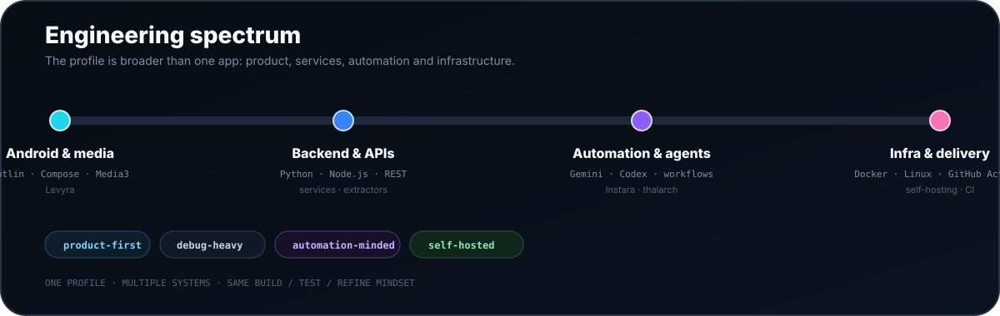

<picture>
  <source media="(prefers-color-scheme: dark)" srcset="./assets/brand/luc4n3x-lockup-dark.svg">
  <source media="(prefers-color-scheme: light)" srcset="./assets/brand/luc4n3x-lockup.svg">
  
</picture>

 

**I build software I want to use — and keep working on it until it feels right.**

`Android` · `Kotlin` · `Jetpack Compose` · `Python` · `APIs` · `Docker`

 

## About me

Hey, I'm Luca. I like taking rough ideas and turning them into software I can actually use.

Most days I bounce between **Android apps, backend services, tooling and infrastructure**. The part I enjoy most usually starts after something already works: finding the weird behavior, making it faster, cleaning up the rough edges and getting the details to feel right.

- I work a lot with **Kotlin, Jetpack Compose, Python, Node.js, Linux and Docker**
- 🔧 I like bugs that only show up on one device, one network or one very specific path
- I prefer a focused fix I understand well over a rewrite just because the diff looks impressive
- 🎧 **Levyra** is one project where a lot of my Android and product ideas end up
- If it involves **Android, self-hosting, APIs, performance or useful tools**, I'm probably interested

 

---

## ✦ Featured Project

### [Levyra](https://github.com/LUC4N3X/Levyra-deepsound)

**A modern Android music app built around playback, discovery and the details that make the whole thing feel finished.**

  
  
  
  

<table width="100%">
  <tr>
    <td width="50%" valign="top">
      <h3>Playback that holds up</h3>
      <ul>
        <li>Media3 / ExoPlayer playback with queue handling and recovery</li>
        <li>Lyrics, downloads and video mode built into the listening flow</li>
        <li>Fallbacks for the moments when networks and upstream sources get messy</li>
      </ul>
    </td>
    <td width="50%" valign="top">
      <h3>Built like a product</h3>
      <ul>
        <li>Memory, caching and device-specific behavior are treated as real features</li>
        <li>Discovery and UI polish get the same attention as the playback engine</li>
        <li>Small, tested improvements over rewrites that only make the diff bigger</li>
      </ul>
    </td>
  </tr>
</table>

  
  
  

  

---

## The rest of the picture

A snapshot of the public work behind the username.

  

  

  

---

## How I like to build

The interesting problems usually start when something works **almost** perfectly.

An app that behaves on one device and not another. An API that is fast until an upstream service slows down. A workflow that is fine once but annoying the hundredth time. A UI that technically works but still feels a little off.

That's the part I enjoy: understand what is actually happening, fix the smallest useful piece, test the ugly paths and leave the codebase cleaner than before.

---

### Build it. Use it. Break it. Understand it. Ship the better version.

**There is usually another build in progress.**

 

