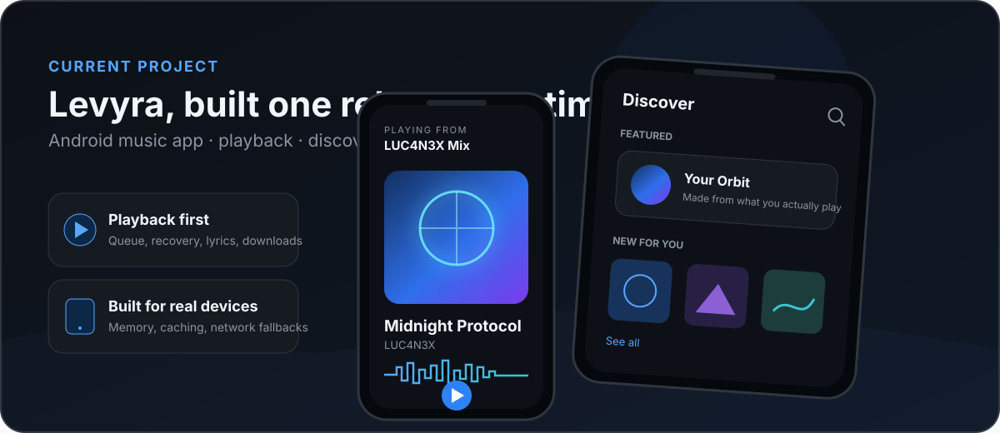
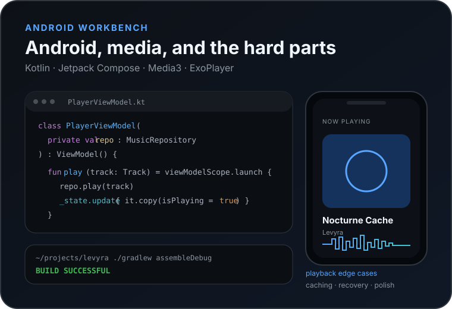
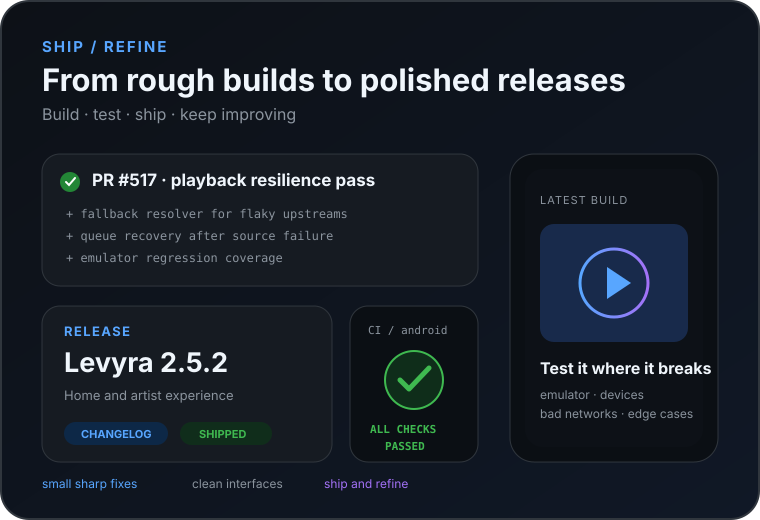

<picture>
  <source media="(prefers-color-scheme: dark)" srcset="./assets/brand/luc4n3x-lockup-dark.svg">
  <source media="(prefers-color-scheme: light)" srcset="./assets/brand/luc4n3x-lockup.svg">
  
</picture>

 

**I build software I want to use — and keep working on it until it feels right.**

`Android` · `Kotlin` · `Jetpack Compose` · `Media3` · `Python` · `Docker`

 

## About me

Hey, I'm Luca. I spend a lot of my time building Android stuff, breaking it, fixing it and then finding one more thing I want to improve.

Most of that work ends up in **[Levyra](https://github.com/LUC4N3X/Levyra-deepsound)**, my music app. I enjoy the part after "it works": making playback smoother, cleaning up rough edges, tracking down weird device problems and getting the little details right.

- 🎧 Right now I'm building **Levyra** and pushing it forward one release at a time
- Most of my day-to-day work is **Kotlin, Jetpack Compose, Media3 and ExoPlayer**
- 🔧 I like chasing the annoying bugs: flaky networks, caching issues, memory pressure and playback edge cases
- I usually prefer a focused fix I understand well over a rewrite for the sake of rewriting
- If you're into **Android, media playback, performance or product polish**, we'll probably have something to talk about

 

---

## ✦ Featured Project

### [Levyra](https://github.com/LUC4N3X/Levyra-deepsound)

**A modern Android music app built around playback, discovery and the details that make the whole thing feel finished.**

  
  
  
  

<table width="100%">
  <tr>
    <td width="50%" valign="top">
      <h3>Playback that holds up</h3>
      <ul>
        <li>Media3 / ExoPlayer playback with queue handling and recovery</li>
        <li>Lyrics, downloads and video mode built into the listening flow</li>
        <li>Fallbacks for the moments when networks and upstream sources get messy</li>
      </ul>
    </td>
    <td width="50%" valign="top">
      <h3>Built like a product</h3>
      <ul>
        <li>Memory, caching and device-specific behavior are treated as real features</li>
        <li>Discovery and UI polish get the same attention as the playback engine</li>
        <li>Small, tested improvements over rewrites that only make the diff bigger</li>
      </ul>
    </td>
  </tr>
</table>

  
  
  

  

---

## Behind the builds

Less stats, more of what I'm actually building.

  

 

<table width="100%">
  <tr>
    <td width="50%" valign="top">
      
    </td>
    <td width="50%" valign="top">
      
    </td>
  </tr>
</table>

---

## How I like to build

The interesting problems usually start when something works **almost** perfectly.

A player that is smooth on one phone but slowly grows memory on another. A download that succeeds nine times out of ten. A resolver that is fast until an upstream service starts behaving badly. A UI that works, but still feels one pass away from being right.

That is the part I enjoy: understanding the failure, fixing the smallest useful piece, testing the ugly paths and leaving the codebase cleaner than before.

---

### Build it. Use it. Find what breaks. Make it better.

**Right now, that project is Levyra.**

 

