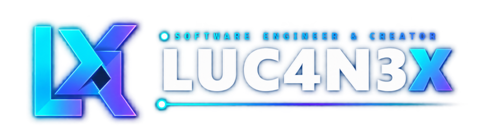

<picture>
  <source media="(prefers-color-scheme: dark)" srcset="./assets/brand/luc4n3x-lockup-dark.png">
  <source media="(prefers-color-scheme: light)" srcset="./assets/brand/luc4n3x-lockup.png">
  
</picture>

I build software I want to use, and keep working on it until it feels right.

 

🌐 **[luc4n3x.pages.dev](https://luc4n3x.pages.dev)**: *Official Website & Engineering Notes*

 

`Android` · `Kotlin` · `Jetpack Compose` · `Python` · `APIs` · `Docker`

 

## About me

Hey, I'm LUC4N3X. I build software for myself and share what turns out useful.

Most days I work on Android apps, backend APIs, and small automation tools. I spend most of my time on the details that make software pleasant to use: fixing edge cases, tracking down device-specific bugs, and keeping the codebase straightforward.

- Primary stack: Kotlin, Jetpack Compose, Python, Node.js, Linux, and Docker
- I enjoy tracking down tricky bugs that only happen on specific devices or weird network paths
- I prefer a small, focused fix over an unnecessary rewrite
- Most of my active Android development goes into Levyra
- Always interested in audio engineering, self-hosting, and practical developer tools

 

---

## Featured project

<a href="https://github.com/LUC4N3X/Levyra-deepsound">
  <picture>
    <source media="(prefers-color-scheme: dark)" srcset="./assets/levyra/levyra-lockup-dark.svg">
    <source media="(prefers-color-scheme: light)" srcset="./assets/levyra/levyra-lockup.svg">
    
  </picture>
</a>

 

  <a href="https://github.com/LUC4N3X/Levyra-deepsound"><strong>Repository</strong></a> ·
  <a href="https://github.com/LUC4N3X/Levyra-deepsound/releases/latest"><strong>Latest release</strong></a> ·
  <a href="https://levyra.dpdns.org"><strong>Website</strong></a>

Levyra is an open-source music player for Android and Windows, built for native audio playback, offline downloads, synced lyrics, and local-first privacy with no accounts or tracking.

- Audio engine: AndroidX Media3 / ExoPlayer pipeline with gapless playback and custom session handling
- Offline storage: Resumable background downloads with embedded metadata and artwork
- Synced lyrics: Synchronized lyrics via LRCLIB with manual offset controls
- Interface: Pure Jetpack Compose with Material You theming and desktop support

---

## Technologies I work with

My daily environment runs on Linux. I prefer a compact, dependable stack that stays out of the way:

- Android: Kotlin and Jetpack Compose for UI, AndroidX Media3 and ExoPlayer for audio playback and foreground services
- Backend & APIs: Python with FastAPI and AsyncIO for services and background workers, Node.js for small utilities
- Persistence & caching: SQLite and Room for local offline data, Redis when fast in-memory caching is needed
- Infrastructure: Docker on Linux hosts, Cloudflare for reverse proxying, and GitHub Actions for CI/CD

 

---

## How I build

Start with something actually useful, run it on real hardware, fix what breaks, and refine the interface once the foundation is solid.

 

<a href="https://github.com/LUC4N3X?tab=repositories">
  <picture>
    <source media="(prefers-color-scheme: dark)" srcset="./assets/brand/how-i-build-dark.svg">
    <source media="(prefers-color-scheme: light)" srcset="./assets/brand/how-i-build.svg">
    
  </picture>
</a>

