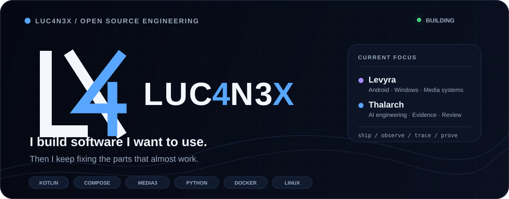
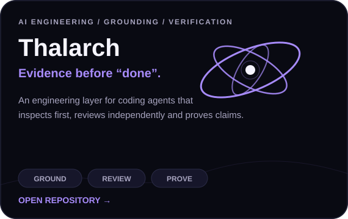
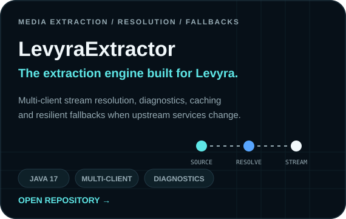
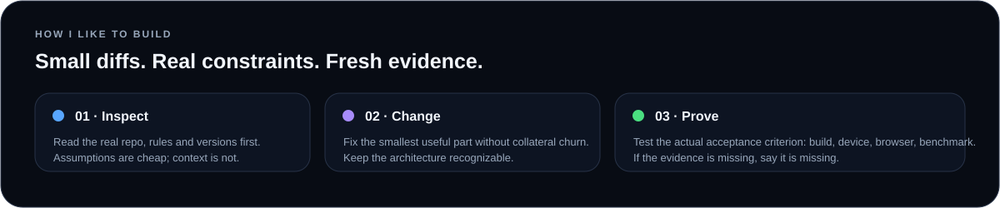

 
 

<a href="#selected-work"><b>Selected work</b></a>
&nbsp;&nbsp;·&nbsp;&nbsp;
<a href="#engineering"><b>Engineering</b></a>
&nbsp;&nbsp;·&nbsp;&nbsp;
<a href="#about"><b>About</b></a>

 

## Selected work

Systems I actively build, ship, debug and maintain.

 

  <a href="https://github.com/LUC4N3X/Levyra-deepsound"><b>Repository</b></a>
  &nbsp;·&nbsp;
  <a href="https://github.com/LUC4N3X/Levyra-deepsound/releases/latest">Latest release</a>
  &nbsp;·&nbsp;
  <a href="https://f-droid.org/packages/com.luc4n3x.levyra/">F-Droid</a>
  &nbsp;·&nbsp;
  <a href="https://github.com/LUC4N3X/Levyra-deepsound/issues">Issues</a>

 

<table width="100%">
  <tr>
    <td width="50%" valign="top">
      
    </td>
    <td width="50%" valign="top">
      
    </td>
  </tr>
</table>

  <a href="https://github.com/LUC4N3X/antigravity-thalarch#benchmark--proof-not-promises">Thalarch benchmarks</a>
  &nbsp;&nbsp;·&nbsp;&nbsp;
  <a href="https://github.com/LUC4N3X/LevyraExtractor/releases">LevyraExtractor releases</a>
  &nbsp;&nbsp;·&nbsp;&nbsp;
  <a href="https://github.com/LUC4N3X?tab=repositories">All public repositories →</a>

 
 

## How I build

Real constraints, narrow changes and evidence that matches the claim.

 

 

  <code>Kotlin</code>
  &nbsp;·&nbsp;
  <code>Jetpack Compose</code>
  &nbsp;·&nbsp;
  <code>Media3 / ExoPlayer</code>
  &nbsp;·&nbsp;
  <code>Java</code>
  &nbsp;·&nbsp;
  <code>Python</code>
  &nbsp;·&nbsp;
  <code>Node.js</code>
  &nbsp;·&nbsp;
  <code>Docker</code>
  &nbsp;·&nbsp;
  <code>Linux</code>
  &nbsp;·&nbsp;
  <code>GitHub Actions</code>

 

---

## About

I'm Luca. Most of my projects start because I want something to exist, use it for real, and eventually find the edge cases the first version did not account for.

The part I enjoy most is when software works **almost** perfectly: playback that behaves differently on one device, an upstream service that changes without warning, a UI that is technically correct but still feels wrong, or a fix that looks obvious until the evidence says otherwise.

I prefer understanding the failure, making the smallest useful change and verifying the result over hiding the problem behind a rewrite.

 

### Build it. Use it. Find what breaks. Make it better.

Open source · real users · real bugs · better software.

 
 

<a href="https://github.com/LUC4N3X?tab=repositories"><b>Explore my repositories →</b></a>

