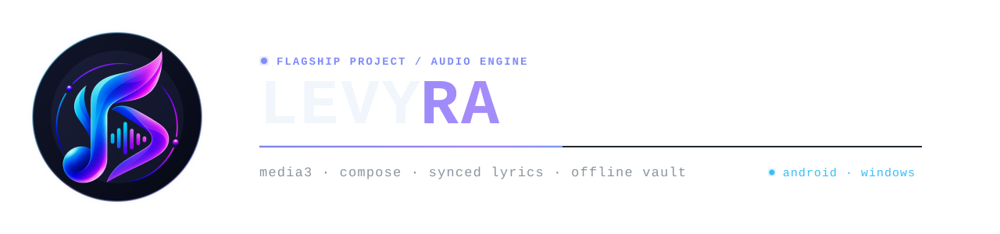
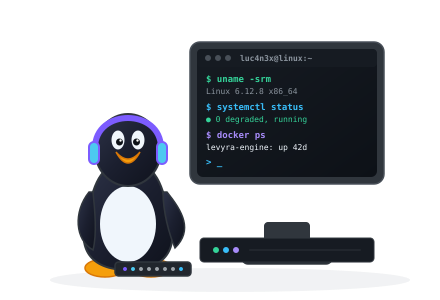

<div align="center">

<picture>
  <source media="(prefers-color-scheme: dark)" srcset="./assets/brand/luc4n3x-lockup-dark.svg">
  <source media="(prefers-color-scheme: light)" srcset="./assets/brand/luc4n3x-lockup.svg">
  
</picture>

<br />

**I build software I want to use, and keep working on it until it feels right.**

`Android` · `Kotlin` · `Jetpack Compose` · `Python` · `APIs` · `Docker`

<br />


</div>

## About me


Hey, I'm Luca. I like taking rough ideas and turning them into software I can actually use.

Most days I bounce between **Android apps, backend services, tooling and infrastructure**. I enjoy the part after something starts working: finding what still feels off, fixing the weird edge cases and making the whole thing cleaner.

- I work mostly with **Kotlin, Jetpack Compose, Python, Node.js, Linux and Docker**
- I like bugs that only show up on one device, one network or one very specific path
- I prefer a focused fix I understand well over a rewrite just because the diff looks impressive
- **Levyra** is where a lot of my Android and product ideas end up
- If it involves **Android, self-hosting, APIs, performance or useful tools**, I'm probably interested

<br clear="right"/>

---

## Featured project

<div align="center">

<a href="https://github.com/LUC4N3X/Levyra-deepsound">
  <picture>
    <source media="(prefers-color-scheme: dark)" srcset="./assets/levyra/levyra-lockup-dark.svg">
    <source media="(prefers-color-scheme: light)" srcset="./assets/levyra/levyra-lockup.svg">
    
  </picture>
</a>

<br />

<p>
  <a href="https://github.com/LUC4N3X/Levyra-deepsound"><strong>Repository</strong></a> · 
  <a href="https://github.com/LUC4N3X/Levyra-deepsound/releases/latest"><strong>Latest release</strong></a> · 
  <a href="https://levyra.dpdns.org"><strong>Website</strong></a>
</p>

</div>

Levyra is an open-source music player for Android and Windows. It focuses on low-latency playback with AndroidX Media3, offline downloads, synced lyrics via LRCLIB, and a fluid Jetpack Compose interface with zero tracking.

- **Audio engine:** AndroidX Media3 and ExoPlayer pipeline, custom session handling, gapless playback
- **Offline vault:** Resumable background downloads, local cache hierarchy, audio tag embedding
- **Synced lyrics:** Real-time synchronized lyrics scoring and custom extraction pipeline
- **Interface:** Pure Jetpack Compose with Material You dynamic theming and desktop support

---

## Technologies I work with



My environment is built entirely on Linux. I prefer a focused, predictable set of tools I can rely on when things get complicated:

- **Android core:** **Kotlin** and **Jetpack Compose** for building fluid UI without legacy XML overhead. **AndroidX Media3** and **ExoPlayer** for audio sessions and foreground services that never drop playback.
- **Async & APIs:** **Python** with **FastAPI** and **AsyncIO** for high-throughput concurrency, task queues, and automated workers. **Node.js** for lightweight scrapers and edge utilities.
- **Offline vault:** **Room** and **SQLite** for dependable offline-first data that never vanishes on restart. **Redis** when caching speed is critical.
- **Infrastructure:** **Docker** on lean **Linux** instances, reverse-proxied through **Cloudflare**, and shipped with reproducible **GitHub Actions** workflows.

<br clear="right"/>

---

## How I build

Software gets good when you test under real constraints and feel every rough edge yourself:

```diff
- Rewrite entire subsystems because an edge case is hard to reproduce
+ Trace the callstack on real hardware and apply the smallest durable fix

- Rely on emulators and assume ideal desktop network conditions
+ Test against thermal throttling, spotty cellular handoffs, and aggressive OEM background killers

- Treat offline as an unexpected error state
+ Offline-first by default: local cache is primary, network is just for synchronization

- Rely solely on synthetic test suites to assess quality
+ Daily-drive what I ship and eliminate every friction firsthand
```

<div align="center">

<br />

<a href="https://github.com/LUC4N3X?tab=repositories">
  <picture>
    <source media="(prefers-color-scheme: dark)" srcset="./assets/brand/github-cta-dark.svg">
    <source media="(prefers-color-scheme: light)" srcset="./assets/brand/github-cta.svg">
    
  </picture>
</a>

</div>