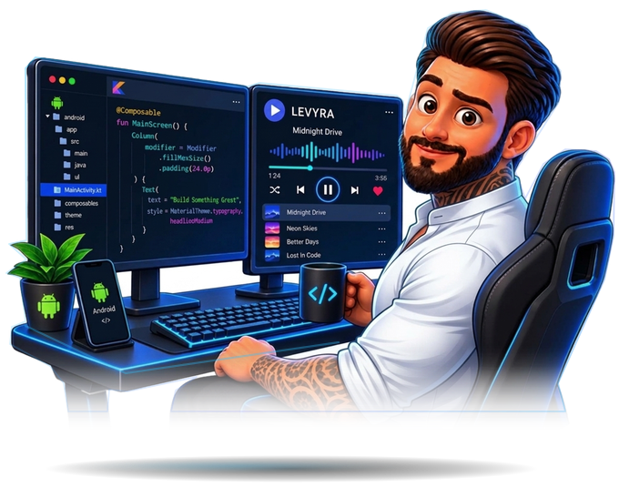

<picture>
  <source media="(prefers-color-scheme: dark)" srcset="./assets/brand/luc4n3x-lockup-dark.svg">
  <source media="(prefers-color-scheme: light)" srcset="./assets/brand/luc4n3x-lockup.svg">
  
</picture>

 

**I build software I want to use — and keep working on it until it feels right.**

`Android` · `Kotlin` · `Jetpack Compose` · `Python` · `APIs` · `Docker`

 

## About me

Hey, I'm Luca. I like taking rough ideas and turning them into software I can actually use.

Most days I bounce between **Android apps, backend services, tooling and infrastructure**. I enjoy the part after something starts working: finding what still feels off, fixing the weird edge cases and making the whole thing cleaner.

- I work mostly with **Kotlin, Jetpack Compose, Python, Node.js, Linux and Docker**
- I like bugs that only show up on one device, one network or one very specific path
- I prefer a focused fix I understand well over a rewrite just because the diff looks impressive
- **Levyra** is where a lot of my Android and product ideas end up
- If it involves **Android, self-hosting, APIs, performance or useful tools**, I'm probably interested

 

---

## Featured project

<table>
  <tr>
    <td width="104" align="center" valign="middle">
      
    </td>
    <td valign="middle">
      <h3><a href="https://github.com/LUC4N3X/Levyra-deepsound">Levyra</a></h3>
      
<strong>Open-source music player for Android and Windows.</strong>

      
Playback, discovery, synced lyrics, downloads and the small details that make the app feel finished.

      
<code>Kotlin</code> · <code>Jetpack Compose</code> · <code>Media3</code> · <code>ExoPlayer</code>

      
<a href="https://github.com/LUC4N3X/Levyra-deepsound"><strong>Repository</strong></a> · <a href="https://github.com/LUC4N3X/Levyra-deepsound/releases/latest"><strong>Latest release</strong></a> · <a href="https://levyra.dpdns.org"><strong>Website</strong></a>

    </td>
  </tr>
</table>

---

### 01 / Current projects

- [**Levyra**](https://github.com/LUC4N3X/Levyra-deepsound) — Android & Windows music player
- [**Instara-Crew**](https://github.com/LUC4N3X/Instara-Crew) — multi-account Instagram operations console
- [**antigravity-thalarch**](https://github.com/LUC4N3X/antigravity-thalarch) — reliability tooling for coding agents

### 02 / Other repositories

- [**LevyraExtractor**](https://github.com/LUC4N3X/LevyraExtractor) — media extractor stack used by Levyra
- [**apps.obtainium.imranr.dev**](https://github.com/LUC4N3X/apps.obtainium.imranr.dev) — Obtainium catalog contributions
- [**LUC4N3X**](https://github.com/LUC4N3X/LUC4N3X) — profile README and branding

### 03 / Recent pull requests

- [#520 Add Levyra Ambient, Rediscover, artist exclusions, playlist tags and hidden playlists](https://github.com/LUC4N3X/Levyra-deepsound/pull/520)
- [#519 Improve project-local RTK handling for ADB diagnostics](https://github.com/LUC4N3X/Levyra-deepsound/pull/519)
- [#517 Update the extractor stack and add per-capability client policy](https://github.com/LUC4N3X/Levyra-deepsound/pull/517)
- [#516 Add authentic YouTube comment cards to the Resonance shelf](https://github.com/LUC4N3X/Levyra-deepsound/pull/516)
- [#514 Polish Home collections, videos, resonance and ambience](https://github.com/LUC4N3X/Levyra-deepsound/pull/514)

---

## How I like to build

Build the useful thing first. Run it on real devices. Find what breaks. Fix the smallest real cause. Then go back for the polish.

**Build it. Use it. Break it. Understand it. Ship the better version.**

