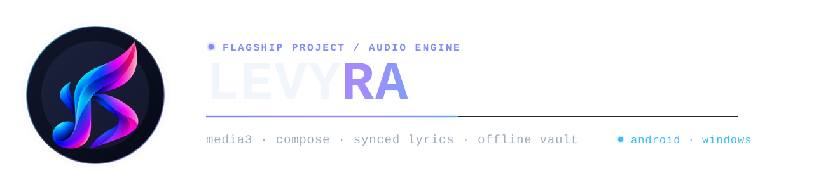

  <picture>
    <source media="(prefers-color-scheme: dark)" srcset="./assets/brand/luc4n3x-banner-dark.svg">
    <source media="(prefers-color-scheme: light)" srcset="./assets/brand/luc4n3x-banner.svg">
    
  </picture>

   

  Independent software developer · Creator of <a href="https://github.com/LUC4N3X/Levyra-deepsound"><b>Levyra</b></a>

    

  

    <a href="https://luc4n3x.pages.dev"><b>Website</b></a> ·
    <a href="https://github.com/LUC4N3X/Levyra-deepsound"><b>Levyra</b></a> ·
    <a href="https://github.com/LUC4N3X/Levyra-deepsound/releases/latest"><b>Latest Release</b></a> ·
    <a href="mailto:lucadrog0@outlook.it"><b>Email</b></a>
  

---

I build software I want to use, and keep working on it until it feels right.

Most of my work is around **Android & Kotlin**, **Linux & CLI tools**, and **reverse engineering**. I care about performance, clear interfaces, and tools that respect the user.

---

### Flagship Project

  <a href="https://github.com/LUC4N3X/Levyra-deepsound">
    <picture>
      <source media="(prefers-color-scheme: dark)" srcset="./assets/levyra/levyra-lockup-dark.svg">
      <source media="(prefers-color-scheme: light)" srcset="./assets/levyra/levyra-lockup.svg">
      
    </picture>
  </a>

**[Levyra](https://github.com/LUC4N3X/Levyra-deepsound)** is an open-source music player for **Android** and **Windows**, built with Kotlin, Compose Multiplatform, Jetpack Media3, and libVLC.

- Streaming (verified 320 kbps AAC) and local library playback with synced lyrics and offline downloads
- Levyra Enhanced Audio DSP (2048-point FFT cutoff detection and spectral band replication)
- Equalizer, audio effects, and encrypted local backup
- No telemetry, no ads, and no accounts (`0 trackers` verified by [Apptizo](https://apptizo.com/app/levyra/))
- Available on [GitHub Releases](https://github.com/LUC4N3X/Levyra-deepsound/releases/latest), [F-Droid](https://f-droid.org/packages/com.luc4n3x.levyra/), [IzzyOnDroid](https://apt.izzysoft.de/fdroid/index/apk/com.luc4n3x.levyra), [OpenAPK](https://www.openapk.net/levyra/com.luc4n3x.levyra/), and [SourceForge](https://sourceforge.net/projects/levyra.mirror/)
- Community translations in 37 languages on [Hosted Weblate](https://hosted.weblate.org/engage/levyra/)

#### Featured

- **Kotlin Weekly** · [mailchi.mp/kotlinweekly/kotlin-weekly-530](https://mailchi.mp/kotlinweekly/kotlin-weekly-530)
- **Techno360** · [techno360.in/levyra-review](https://techno360.in/levyra-review/)
- **Australia By Aussie** · [australiabyaussie.com/levyra-open-source-music-player-gains-kotlin-spotlight](https://australiabyaussie.com/levyra-open-source-music-player-gains-kotlin-spotlight/)
- **OSCHINA 开源中国** · [oschina.net/news/502584](https://www.oschina.net/news/502584)
- **CSDN** · [blog.csdn.net/techforward/article/details/165886477](https://blog.csdn.net/techforward/article/details/165886477)
- **SecurityLab.ru** · [securitylab.ru/blog/personal/SimlpeHacker/362601.php](https://www.securitylab.ru/blog/personal/SimlpeHacker/362601.php)
- **GeekParadize** · [geekparadize.fr/articles/levyra-lecteur-musical-open-source-android-windows](https://www.geekparadize.fr/articles/levyra-lecteur-musical-open-source-android-windows)
- **OpenSalerno** · [opensalerno.it/levyra-musica-libera-da-account...](https://www.opensalerno.it/levyra-musica-libera-da-account-pubblicita-e-tracciamento-un-nuovo-player-open-source-android-e)
- **Techolay** · [techolay.net/levyra-android-ve-windows-icin-acik-kaynak-muzik-oynaticisi](https://techolay.net/levyra-android-ve-windows-icin-acik-kaynak-muzik-oynaticisi/)
- **Hysen Labs** · [hysenlabs.com/en/projects/luc4n3x-levyra-deepsound](https://hysenlabs.com/en/projects/luc4n3x-levyra-deepsound)
- **PitchHut** · [pitchhut.com/project/levyra-music-player](https://www.pitchhut.com/project/levyra-music-player)

---

### Other Repositories

- **[thalarch-layer](https://github.com/LUC4N3X/thalarch-layer)**: Personal Arch Linux setup, dotfiles, and system scripts
- **[Instara-Crew](https://github.com/LUC4N3X/Instara-Crew)**: Small Python CLI utility for account analysis

---

### Contact

- **Website:** [luc4n3x.pages.dev](https://luc4n3x.pages.dev)
- **Email:** [lucadrog0@outlook.it](mailto:lucadrog0@outlook.it)
- **GitHub:** [@LUC4N3X](https://github.com/LUC4N3X)
